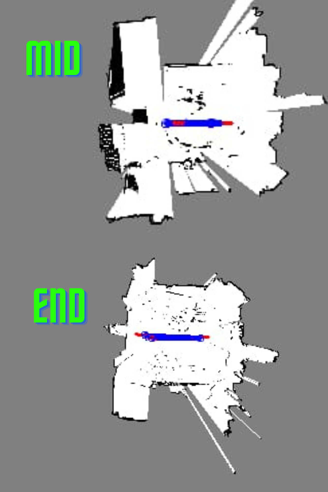

# Autonomous Mobile Robot SLAM Workspace

## Overview

This workspace contains a comprehensive set of projects for Simultaneous Localization and Mapping (SLAM) on autonomous mobile robots. The main focus is the `slam_project/` directory, which implements and tests SLAM algorithms on real-world robots using actual sensor data. Other directories provide simulation environments, experimental modules, and hardware drivers for development and testing.

## Techniques Used

### Two-Stage Kalman Filter

The SLAM system employs a two-stage Kalman Filter approach for robust localization and sensor fusion:
- **Stage 1:** An Extended Kalman Filter (EKF) fuses IMU and LIDAR data to estimate the robot's pose (position and orientation) in real time.
- **Stage 2:** A velocity EKF further refines the robot's velocity and motion model, improving accuracy in dynamic environments and during rapid maneuvers.

This multi-stage filtering enhances the reliability of localization, especially when individual sensors are noisy or have limited observability.

### ICP (Iterative Closest Point)

The system uses the ICP algorithm for scan matching and map refinement:
- **Scan Matching:** ICP aligns consecutive LIDAR scans to estimate the robot's movement between frames, correcting for drift and improving map consistency.
- **Map Refinement:** By matching current scans to the global map, ICP helps maintain accurate localization and map updates, even in challenging environments.

### Path Planning (A*)

An A* algorithm is implemented for autonomous navigation:
- Plans optimal paths through the occupancy grid map generated by SLAM.
- Supports dynamic obstacle avoidance and real-time replanning.

### Occupancy Grid Mapping

LIDAR data is used to build a 2D occupancy grid map of the environment, which is continuously updated as the robot explores.

### Sensor Fusion

The system integrates data from multiple sensors (LIDAR, IMU) using custom fusion logic and Kalman filtering, without relying on external frameworks.

## No External Frameworks

**This project does NOT use frameworks like ROS (Robot Operating System) or third-party SLAM libraries.**
- All algorithms (Kalman Filter, ICP, A*, mapping, sensor drivers) are implemented from scratch using standard C++ libraries and basic dependencies (Eigen for linear algebra, OpenCV for visualization).
- This approach ensures full control, transparency, and portability of the code, making it suitable for research, education, and deployment on resource-constrained hardware.

## Directory Structure

```
.
├── CMakeLists.txt
├── firrstcorrectedmap.png
├── ICPMatcherv2.cpp
├── LICENSE
├── lidar_data.csv
├── main.cpp
├── README.md
├── build/
├── Full simulation/
├── Gazebo Simulation/
├── imutest/
├── lidarsdk/
├── slam_project/
```

### Key Directories

- `slam_project/`: **Main SLAM implementation for real robots.** Contains mapping, localization, navigation, sensor drivers, and communication modules. This code is tested on actual hardware.
- `Full simulation/`: Contains simulation code for algorithm development and testing, including A* path planning, EKF localization, and simulated sensors.
- `Gazebo Simulation/`: Gazebo-based simulation environment for virtual robot testing.
- `imutest/`: Standalone IMU driver and test code.
- `lidarsdk/`: RPLIDAR SDK and related utilities for LIDAR sensor integration.

## slam_project Details

### Features

- **Real-World SLAM:** Integrates 2D LIDAR, IMU, and wheel odometry for mapping and localization.
- **Mapping:** Occupancy grid mapping using LIDAR data.
- **Localization:** Extended Kalman Filter (EKF) for sensor fusion and pose estimation.
- **Path Planning:** A* algorithm for autonomous navigation.
- **ICP Scan Matching:** Refines robot pose using Iterative Closest Point.
- **Visualization:** Map and trajectory visualization with OpenCV.
- **Communication:** Serial port communication with robot actuators (`Communication/send.hpp`).
- **Sensor Drivers:** Includes RPLIDAR and BNO055 IMU drivers.
- **Modular Design:** Easy to extend and integrate new sensors or algorithms.

### Main Components

- `main.cpp`: Entry point, initializes modules and runs the SLAM loop.
- `Communication/send.hpp`: Serial communication with robot hardware.
- `lidar/`, `imu/`, `mapping/`, `EKF/`, `Astar/`, `icp/`, `trajectoryVizualizer/`: Submodules for sensors, mapping, localization, planning, and visualization.
- `External/eigen/`: Eigen library for linear algebra.
- `rplidar_sdk/`: RPLIDAR SDK for LIDAR integration.

## Simulations & Testing

- **Gazebo Simulation:** Use Gazebo for realistic physics and sensor simulation.
- **imutest:** Test and calibrate IMU sensors independently.

## Building the Project

### Prerequisites

- C++17 compiler
- CMake >= 3.10
- OpenCV 4.x
- Eigen (included)
- RPLIDAR SDK (included)
- pthread (Linux)

### Build Instructions

1. Clone the repository:
   ```sh
   git clone https://github.com/yourusername/AMR_controller_SLAM-main.git
   cd AMR_controller_SLAM-main
   ```

2. Install dependencies (Ubuntu example):
   ```sh
   sudo apt-get update
   sudo apt-get install build-essential cmake libopencv-dev
   ```

3. Build the main SLAM project:
   ```sh
   cd slam_project
   mkdir build
   cd build
   cmake ..
   make
   ```

   The executable will be generated in the `build` directory.

## Running the SLAM System

1. Connect your robot's sensors (LIDAR, IMU, etc.) to your computer.
2. Run the SLAM executable:
   ```sh
   ./main
   ```
3. The system will start mapping, localizing, and navigating in real time. Visualization windows will show the map and trajectory.

## Data & Results

- **Maps:** Generated occupancy grid maps are saved as PNG files (e.g., `firrstcorrectedmap.png`).
- **Sensor Logs:** Raw sensor data can be logged for offline analysis (`lidar_data.csv`).

Below is a collage showing the mid-term and final maps obtained during testing(final test has integrated the imu, mid one without imu):



## License

This project is licensed under the MIT License. See `LICENSE` for details.

## Acknowledgements

- Eigen
- [OpenCV](https://opencv.org/)
- RPLIDAR SDK
- All contributors and open-source libraries used.

---


For more details, see the source files in `slam_project/`.
